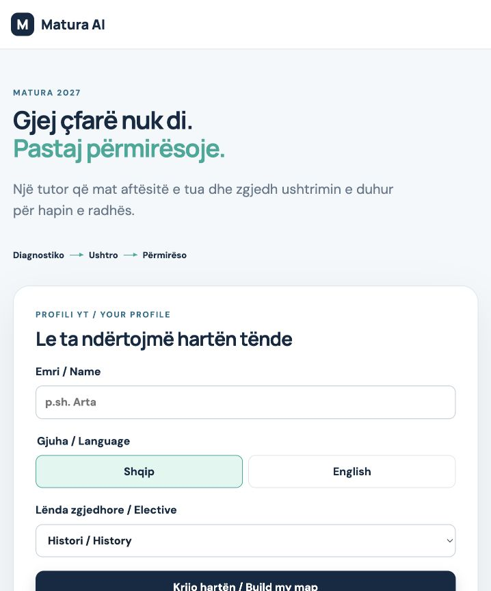
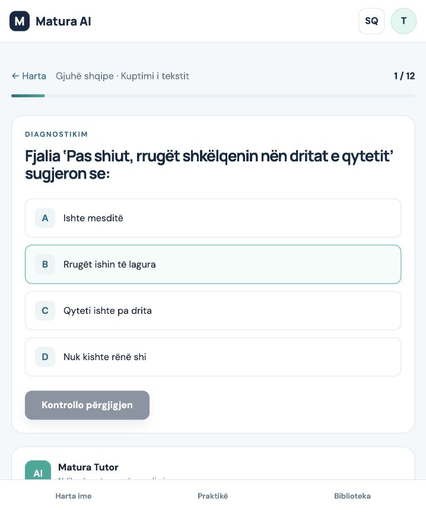
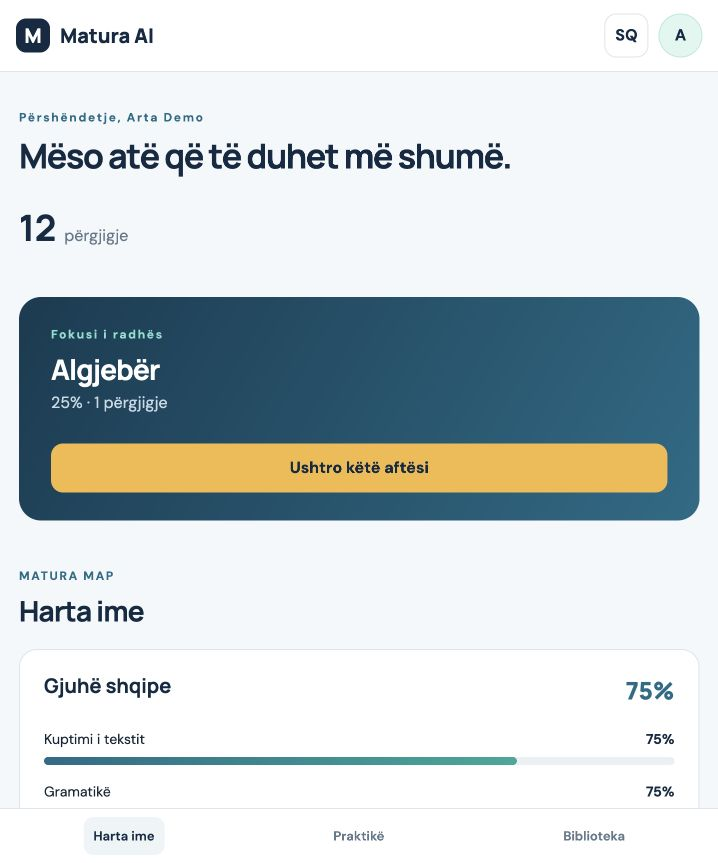
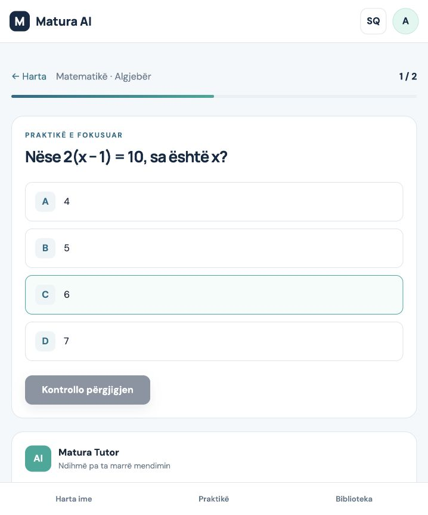
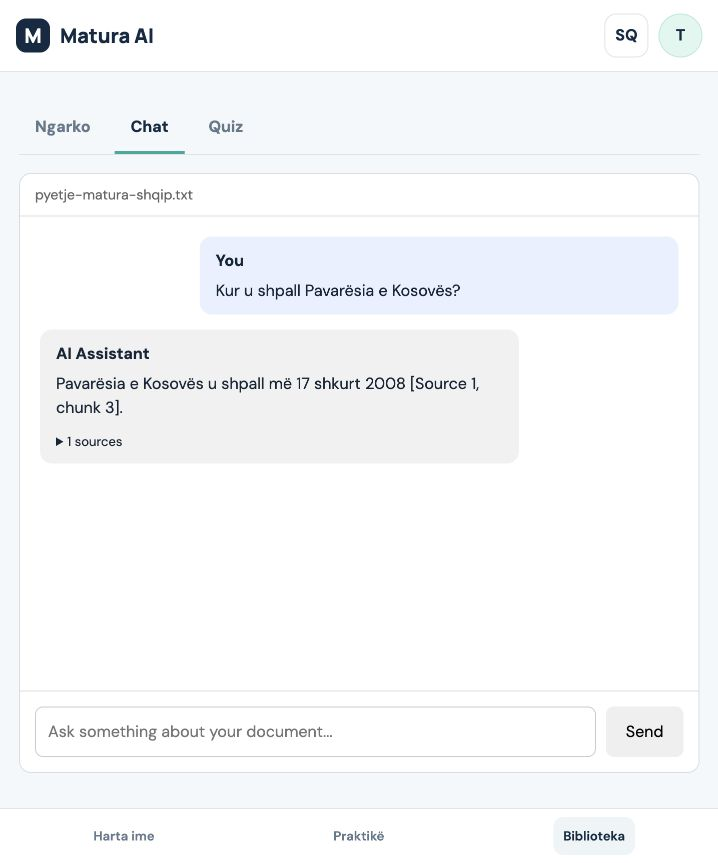
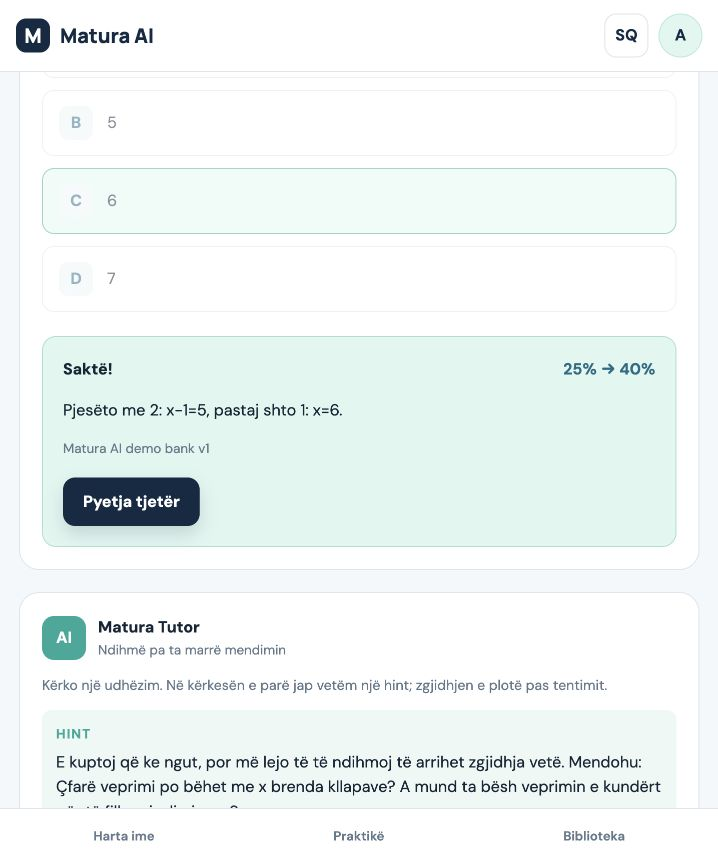

# Matura AI Product Audit

Audit date: 2026-09-25

## Executive verdict

Matura AI now demonstrates a complete and differentiated learning loop:

> Diagnose a student, identify the weakest skill, provide focused practice, offer a hint
> before a solution, grade deterministically, and show measurable improvement.

The project is **ready for a stage-one qualifier demonstration**. It is **not ready for a
public launch across schools or municipalities**. The largest remaining gaps are
curriculum validation, complete localization, authentication and data ownership,
production PostgreSQL verification, operational controls, and a much deeper question
bank.

| Goal | Status | Assessment |
| --- | --- | --- |
| Two-minute judge demonstration | Ready | The seeded demo completes the intended loop reliably. |
| Hackathon qualifier submission | Ready with polish | Product, proof screenshots, architecture, and pitch deck exist. |
| Small supervised school pilot | Not ready | Teacher review, PostgreSQL deployment, privacy, and monitoring are missing. |
| Public 38-municipality launch | Not ready | Authentication, scale, content depth, safety, support, and validation are missing. |

## Audit scope

The audit exercised the running application in the Codex in-app browser at a 718 × 863
viewport. It covered onboarding, diagnostic entry, the seeded Matura Map, focused
practice, progressive tutor help, mastery feedback, PDF/TXT upload, grounded Albanian
chat, and document quiz generation. Repository structure, automated tests, migrations,
configuration, and API behavior were also reviewed.

## Flow evidence

### Step 1 — Onboarding: healthy

**What works**

- The value proposition is clear before the form.
- Name, language, and elective are enough to start.
- The demo option reduces judge setup time.
- Controls have visible labels and large targets.

**Risks**

- The primary CTA falls below the initial 718 × 863 viewport.
- Mixed Albanian/English labels add noise when Albanian is selected.
- The note says the profile is for demonstration, but does not explain that it is stored
  in browser local storage and in the backend database.

### Step 2 — Diagnostic: healthy

**What works**

- Subject, skill, question count, and progress are visible.
- Answer choices are easy to scan and use.
- Correct answers and explanations are not exposed before submission.
- The diagnostic uses all three core subjects and the selected elective.

**Risks**

- The visual progress bar has no explicit progressbar semantics for assistive technology.
- Answer buttons do not expose a selected state such as `aria-pressed`.
- The AI tutor is below the fold, so some students may not discover it.

### Step 3 — Personal Matura Map: healthy

**What works**

- The recommended weakest skill is visually dominant.
- Exact percentages make the result measurable.
- Subject cards provide useful detail without hiding the next action.
- The demo profile creates an understandable 25% Algebra starting point.

**Risks**

- Skill meters rely heavily on visual bars; screen readers receive the text percentage
  but not a named meter relationship.
- A long six-subject map will require better filtering and summary behavior when the
  curriculum expands.
- Percentages can look more precise than the current three-question-per-skill bank
  justifies.

### Step 4 — Focused practice and tutor: healthy

**What works**

- Practice automatically targets the weakest skill.
- Gemma returned a hint when directly asked for the answer.
- After an attempt, Gemma returned a worked solution.
- Stored hints and explanations preserve the flow when OpenRouter fails.
- AI output does not control grading or mastery.

**Risks**

- A skill has only three seeded questions, so meaningful repeated practice is not yet
  possible.
- Repeated practice eventually cycles the same questions.
- Tutor answers are stored, but there is no moderation, rate limiting, cost budget, or
  per-learner usage control.

### Step 5 — Library and grounded chat: mixed

**What works**

- PDF/TXT upload, chunking, embedding, retrieval, citation display, and Gemma answering
  all work end to end.
- Retrieval is scoped to the selected document.
- A failed retrieval returns an explicit refusal instead of an invented answer.
- The tab label now says **Chat**, which is understandable to students.

**Issue found and fixed during the audit**

The original 300-word chunks caused a verbatim Albanian question from the uploaded file
to score only 0.112 against the 0.25 retrieval threshold. Reducing the default to 120
words with 20-word overlap raised the best score to 0.684. After re-uploading, the app
correctly answered that Kosovo declared independence on 17 February 2008 and cited the
retrieved source.

**Remaining risks**

- Upload, chat composer, assistant labels, empty states, and quiz controls remain in
  English when Albanian is selected.
- The visual style of the older Library components does not fully match the adaptive
  learning screens.
- Generated quizzes contain questions only: no answer key, explanation, citation, or
  validation. They should not be used for grading.
- There is no document list, rename, delete, ownership, retention, or privacy control.

### Step 6 — Mastery feedback: healthy

**What works**

- Correctness, explanation, source, and the 25% → 40% change appear together.
- The next action is obvious.
- The result proves that targeted practice updates the Matura Map.

**Risks**

- `Matura AI demo bank v1` is an internal source label. Student-facing content should use
  a real reviewed source or a clearer label such as “Matura AI practice set — teacher
  review pending.”
- The score jump is mathematically correct but large because the bank is small.

## What stays

1. **The diagnostic → map → weakest skill → practice → improvement loop.** This is the
   product's strongest differentiator and should remain the primary experience.
2. **Deterministic grading and mastery.** Keep AI outside correctness and score
   calculation.
3. **Progressive tutor help.** Hint first and solution after an attempt creates a useful
   teaching behavior instead of an answer bot.
4. **Stored bilingual fallback content.** It makes the demo resilient and gives teachers
   something concrete to review.
5. **The SQLAlchemy repository boundary and Alembic migrations.** The separation is clear
   enough to extend and test.
6. **PostgreSQL and pgvector as the deployment path, SQLite for local work.** This is a
   practical development arrangement.
7. **Library as a secondary feature.** Grounded chat is useful for school materials once
   content ownership and retrieval evaluation are added.
8. **The seeded judge profile.** It proves the complete loop quickly without pretending
   to be real traction.
9. **The current visual direction.** The typography, spacing, color system, cards, and
   mobile navigation are coherent and appropriate for a student product.

## What goes or moves out of the core demo

1. **Technical language such as “RAG Chat.”** It has already been changed to **Chat**.
2. **Mixed-language interface strings.** Every visible Library label, loading state,
   fallback error, and button must follow the selected language.
3. **Document quiz generation as a headline feature.** Keep it experimental or hide it
   from the qualifier demo until it returns verified answers, explanations, and sources.
4. **The internal `Matura AI demo bank v1` label.** Replace it with meaningful source
   attribution and review status.
5. **One-click profile deletion through the avatar.** Replace it with a small profile menu
   and a confirmed “Reset demo profile” action.
6. **Unused legacy frontend views.** `Home.vue`, `Chat.vue`, and `Quiz.vue` are no longer
   routed and should be deleted with any obsolete component styles.
7. **The claim of immediate national readiness.** The credible story is a supervised
   two-school pilot, followed by measured expansion.

## Engineering assessment

### Strong enough for the qualifier

- SQLAlchemy entities and repositories cover learners, curriculum, sessions, attempts,
  tutor interactions, documents, and vector chunks.
- Alembic separates schema changes from idempotent seed data.
- API question responses do not leak answers before submission.
- Database and provider errors are structured.
- The root startup command avoids the earlier `ModuleNotFoundError: app` problem.
- All 12 backend tests pass and the frontend production build succeeds.
- The tests cover all three electives, answer leakage, mastery, weakest-skill practice,
  locale changes, tutor progression, AI fallback, and the demo learner.

### Missing for production

- Authentication and authorization for learners and documents.
- Ownership filters on every learner, session, attempt, tutor interaction, and document.
- A verified PostgreSQL migration and end-to-end run in CI.
- Database backups, connection pooling policy, deployment migrations, and rollback drills.
- Rate limits, AI cost limits, retries, timeouts by use case, and provider monitoring.
- Structured application logs, error reporting, latency metrics, and audit events.
- Content moderation, prompt-abuse evaluation, privacy policy, consent, and data deletion.
- A retrieval evaluation set with recall/precision targets in Albanian and English.
- Teacher review workflow, curriculum versioning, and official source attribution.
- Frontend unit or browser tests for the main journey and accessibility checks.
- More than three questions per skill, item difficulty calibration, and protection against
  repeated-question memorization.

## Accessibility assessment

Confirmed strengths from the current browser run include labelled profile fields,
logical heading order, large answer targets, visible focus/selection styling, and readable
contrast in the main learning flow.

Likely issues requiring implementation checks:

- Progress and mastery bars need semantic roles, names, and values.
- Tabs need `tablist`, `tab`, `aria-selected`, and associated tab panels.
- Answer choices need an exposed selected state.
- The language button should announce its action, such as “Switch to English.”
- The avatar should announce “Open profile menu,” rather than only the learner initial.
- Async tutor, upload, answer, and quiz results need live-region announcements.
- Disabled-button contrast and keyboard focus order need automated and manual testing.

This audit does not claim WCAG compliance. A screen-reader pass, keyboard-only pass, 200%
zoom test, and automated axe scan remain necessary.

## Recommended order of work

### Before presenting to judges

1. Finish Albanian localization throughout Library and all error/loading states.
2. Have a Matura teacher review the 54 seeded questions, answers, explanations, and
   source labels.
3. Keep generated Library quizzes out of the main presentation.
4. Run the five-minute demo repeatedly from a clean profile and keep the fallback path
   ready.
5. Verify PostgreSQL migrations and seeding on a clean Docker database.

### Before a supervised school pilot

1. Add real authentication and record ownership.
2. Expand Albanian and Mathematics to a defensible curriculum-sized bank.
3. Add teacher content review and curriculum versioning.
4. Add production monitoring, rate limits, AI budgets, privacy controls, backups, and
   deletion workflows.
5. Run student interviews and observed usability sessions; these are still a validation
   gap.

## Completion decision

The implementation job described for the qualifier is complete: the main experience,
adaptive logic, data model, migrations, resilient tutor, Library, demo profile,
documentation, verification commands, and pitch deck exist and work.

The larger mission described in the challenge is not complete. The current product is a
strong prototype and judgeable proof of the learning loop. It is not yet a safe, validated,
content-complete, or operationally ready national tutoring platform.
